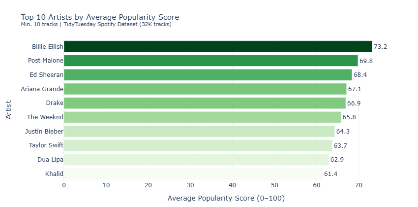
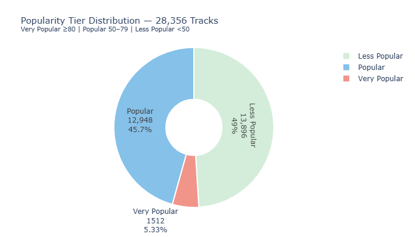
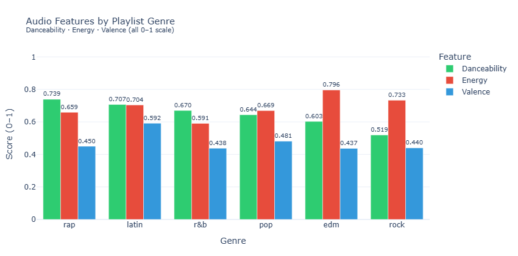

# spotify-etl-pipeline

ETL pipeline on 32,828 real Spotify tracks from the TidyTuesday dataset.
Covers popularity analysis, audio feature analytics, and genre comparison
with a full Extract → Transform → Load → Analyze flow using DuckDB.

---

## pipeline architecture

```
extract (TidyTuesday Spotify CSV — 32,833 raw rows)
        ↓
transform (dedup by track_id, dropna, add duration_minutes,
           release_year, popularity_tier, tempo_category)
        ↓
data quality checks (7 assertions — all pass)
        ↓
load → DuckDB (fact_tracks + dim_genre + dim_artist)
        ↓
SQL analysis (top artists, tier breakdown, genre audio features)
        ↓
Plotly charts (top artists by popularity, tier distribution pie, audio features by genre)
```

---

## stack

| Layer | Tool |
|---|---|
| Data source | TidyTuesday Spotify Songs CSV (32K tracks) |
| Transform | Pandas |
| Warehouse | DuckDB (fact_tracks, dim_genre, dim_artist) |
| Analysis | DuckDB SQL |
| Visualization | Plotly |

---

## warehouse tables

- **fact_tracks** — 28,356 rows (one per unique track after dedup + dropna)
- **dim_genre** — 6 playlist genres
- **dim_artist** — 8,548 unique artists

---

## key findings

- 32,828 tracks loaded, 28,356 after dedup/clean
- **Dance Monkey** by Tones and I — popularity score 100 (top track)
- **ROXANNE** by Arizona Zervas — popularity 99
- Only **5.3%** of tracks are "Very Popular" (score ≥ 80)
- **45.7%** are "Popular" (score 50–79), **49%** Less Popular
- Average popularity across all tracks: **42.5**
- Top artists by avg popularity: Billie Eilish, Post Malone, Ed Sheeran

---

## data quality checks

| Check | Result |
|---|---|
| No null track_id | ✓ |
| No duplicate track_id | ✓ |
| Popularity 0–100 | ✓ |
| Danceability 0–1 | ✓ |
| Energy 0–1 | ✓ |
| No zero duration | ✓ |
| Tempo > 0 | ✓ |

---

## dashboard

**Top 10 artists by average popularity**


**Popularity tier distribution (28,356 tracks)**


**Audio features by genre — danceability, energy, valence**


---

## how to run

```bash
git clone https://github.com/Shibin2000/spotify-etl-pipeline
cd spotify-etl-pipeline
pip install -r requirements.txt
jupyter notebook spotify_etl_pipeline.ipynb
```

No API key needed — uses a public CSV dataset.
